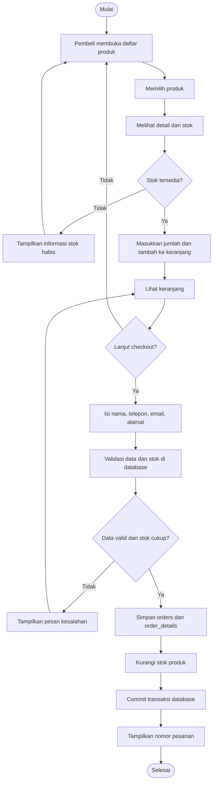

# Alur proses transaksi

```mermaid
flowchart TD
 A([Mulai]) --> B[Pembeli membuka daftar produk]
 B --> C[Memilih produk]
 C --> D[Melihat detail dan stok]
 D --> E{Stok tersedia?}
 E -- Tidak --> F[Tampilkan informasi stok habis]
 F --> B
 E -- Ya --> G[Masukkan jumlah dan tambah ke keranjang]
 G --> H[Lihat keranjang]
 H --> I{Lanjut checkout?}
 I -- Tidak --> B
 I -- Ya --> J[Isi nama, telepon, email, alamat]
 J --> K[Validasi data dan stok di database]
 K --> L{Data valid dan stok cukup?}
 L -- Tidak --> M[Tampilkan pesan kesalahan]
 M --> H
 L -- Ya --> N[Simpan orders dan order_details]
 N --> O[Kurangi stok produk]
 O --> P[Commit transaksi database]
 P --> Q[Tampilkan nomor pesanan]
 Q --> R([Selesai])
```
